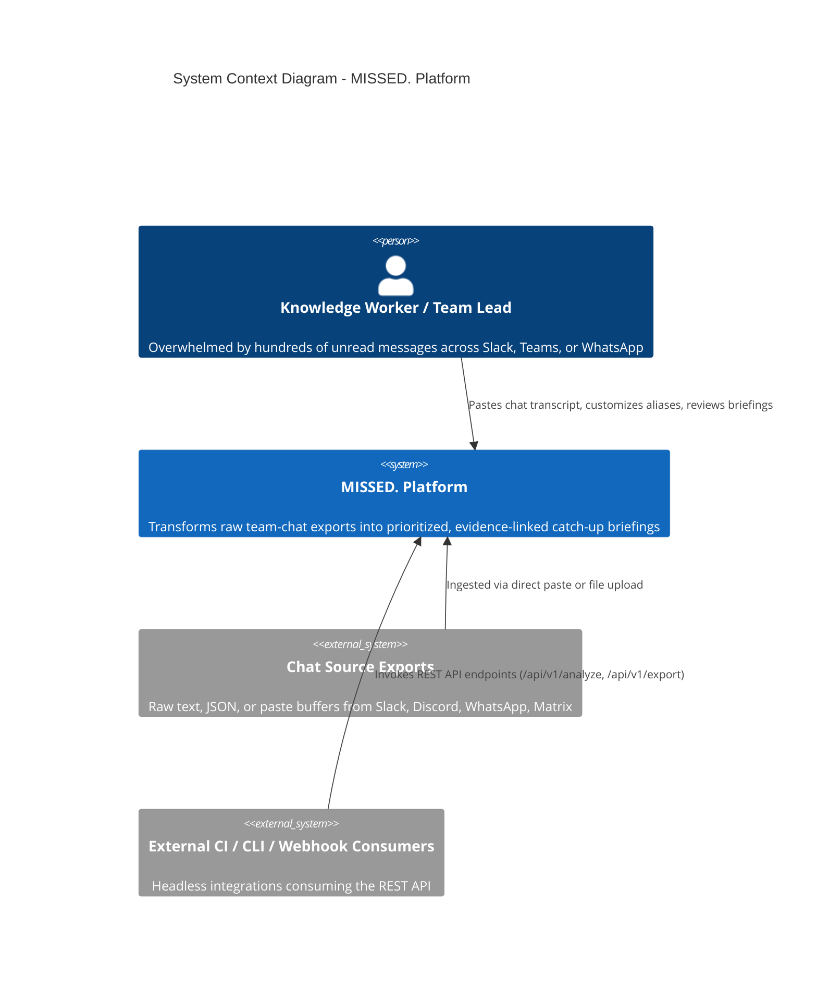
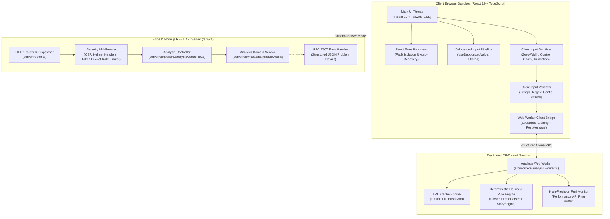
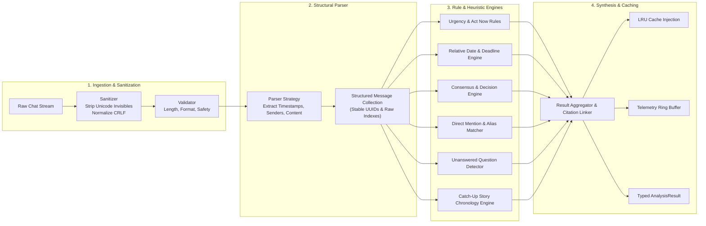

# MISSED. System Architecture & Engineering Specification

> **ProtocolX / MISSED.** — Privacy-First Team Chat Catch-Up Intelligence  
> *Target Architecture Version:* 1.2.0  
> *Classification:* Hybrid Dual-Engine (Edge Serverless / Node.js Micro-API + In-Browser Web Worker)

---

## 1. Executive Architecture Summary

MISSED. is built upon a **Hybrid Dual-Engine Architecture** engineered to resolve the classic tension between absolute data privacy and enterprise API extensibility. 

- **Engine A: Local-First Zero-Knowledge Engine**  
  Executes 100% on-device inside an isolated Web Worker thread. Sensitive conversation text never leaves the client's memory sandbox, guaranteeing zero cloud transmission for confidential conversations.
- **Engine B: Serverless & Micro-API Engine**  
  A lightweight, high-performance Node.js / Vercel Serverless REST API (`/api/v1/*`) operating under strict rate-limiting, RFC 7807 problem details, and deterministic NLP heuristics for headless automation, CLI triage, and team webhooks.

Both engines share identical domain logic, deterministic heuristic pipelines, LRU caching algorithms, and input sanitization layers, ensuring deterministic parity across platforms.

---

## 2. C4 Architectural Blueprint

### Level 1: System Context Diagram



---

### Level 2: Container Diagram (Hybrid Dual-Engine)



---

### Level 3: Component Diagram (Deterministic Analysis Pipeline)



---

## 3. Design Patterns Applied

| Pattern | Component | Architectural Purpose |
|---|---|---|
| **Pipeline Pattern** | `Sanitizer -> Validator -> Parser -> RuleEngine -> Exporter` | Deconstructs monolithic text processing into composable, testable, isolated functional stages. |
| **Strategy Pattern** | `parseConversation` | Detects and adapts to multiple conversational timestamp/sender formatting syntaxes (brackets, colons, Slack timestamps, WhatsApp format). |
| **LRU Cache Pattern** | `AnalysisLRUCache` | Bounded memory footprint (max 10 entries) with least-recently-used eviction and time-to-live expiration to eliminate redundant computations. |
| **Ring Buffer Pattern** | `TimingRingBuffer` | Memory-bounded ($O(1)$ push/eviction) rolling window storing telemetry timings without heap bloat or unbounded growth. |
| **Token Bucket Pattern** | `RateLimiter` | Smooth traffic shaping with burst allowance per client IP to mitigate automated DoS threats. |
| **Fault Isolation Boundary** | `ErrorBoundary` + Web Worker | Traps rendering and parsing failures without taking down the user session. |

---

## 4. REST API Specification (OpenAPI 3.1)

The platform exposes an enterprise-grade REST API available both as standalone Node.js microservices and Vercel serverless edge functions:

### Endpoints Overview

| Method | Endpoint | Description | Rate Limit |
|---|---|---|---|
| `GET` | `/api/v1/health` | Comprehensive system health, engine status, and heap memory diagnostics | 100 req/min |
| `POST` | `/api/v1/analyze` | Full chat analysis returning prioritized findings, story, and stats | 20 req/min |
| `POST` | `/api/v1/parse` | Structural chat parser converting raw text into typed `Message[]` | 40 req/min |
| `POST` | `/api/v1/export` | Formats an `AnalysisResult` into Markdown, Plain Text, or JSON | 60 req/min |
| `GET` | `/api/v1/metrics` | Telemetry performance history, latency metrics, and cache hit ratios | 60 req/min |

### Sample Analysis Request & Response

```bash
# Analyze a conversation export
curl -X POST http://localhost:3001/api/v1/analyze \
  -H "Content-Type: application/json" \
  -d '{
    "text": "[09:00] Alice: Urgent: DB migration Friday at 5pm!\n[09:05] Bob: @bibek please confirm the backup script.",
    "config": {
      "userName": "Bibek",
      "aliases": ["bibek", "@bibek"]
    }
  }'
```

```json
{
  "success": true,
  "data": {
    "summary": [
      "DB migration Friday at 5pm flagged as urgent by Alice.",
      "Direct action assigned to Bibek for backup script confirmation."
    ],
    "items": [
      {
        "id": "item-1",
        "title": "DB migration Friday at 5pm",
        "category": "deadline",
        "priority": "urgent",
        "explanation": "Explicit deadline with urgent modifier.",
        "sourceMessageId": "msg-1",
        "sender": "Alice",
        "deadline": {
          "dateStr": "Friday at 5pm",
          "status": "upcoming"
        }
      }
    ],
    "stats": {
      "totalMessages": 2,
      "participants": ["Alice", "Bob"],
      "urgentCount": 1,
      "taskCount": 1
    }
  },
  "meta": {
    "requestId": "9b1deb4d-3b7d-4bad-9bdd-2b0d7b3dcb6d",
    "timestamp": "2026-10-09T10:50:00.000Z",
    "durationMs": 4.2,
    "cached": false
  }
}
```

---

## 5. Security & Optimization Blueprint

### Defense in Depth Matrix

1. **Zero-Trust Input Sanitization (`sanitizer.ts`)**
   - Strips zero-width Unicode characters (`\u200B` - `\u200D`, `\uFEFF`) used in steganography and homoglyph attacks.
   - Normalizes carriage returns (`\r\n` $\rightarrow$ `\n`).
   - Strips unprintable ASCII control characters (`\x00` - `\x08`, `\x0B` - `\x1F`).
   - Caps input payload length to prevent browser memory exhaustion.

2. **ReDoS Defense & Deterministic Regex Constraints**
   - All regular expressions are strictly bounded, avoiding nested quantifiers that cause exponential backtracking ($O(2^n)$).
   - Pattern execution operates within linear $O(n)$ time complexity relative to conversation length.

3. **HTTP Security Headers**
   - **Content Security Policy (CSP):** `default-src 'self'; worker-src 'self'; frame-ancestors 'none'; object-src 'none';`
   - **MIME Sniffing Prevention:** `X-Content-Type-Options: nosniff`
   - **Clickjacking Protection:** `X-Frame-Options: DENY`
   - **Referrer Privacy:** `Referrer-Policy: strict-origin-when-cross-origin`

4. **Off-Main-Thread Web Worker Isolation**
   - Execution runs outside React's main UI thread, maintaining a solid 60fps frame rate even when parsing transcripts containing thousands of messages.

---

## 6. Algorithmic Complexity & Performance Analysis

| Pipeline Operation | Time Complexity | Space Complexity | Real-World Benchmark (500 msgs) |
|---|---|---|---|
| Input Sanitization | $O(N)$ (string length) | $O(N)$ | $< 0.8\text{ ms}$ |
| Parser Ingestion | $O(M)$ (message count) | $O(M)$ | $< 2.1\text{ ms}$ |
| NLP Rule Matching | $O(M \times R)$ ($R = \text{rule count}$) | $O(K)$ ($K = \text{findings}$) | $< 4.5\text{ ms}$ |
| LRU Cache Lookup | $O(1)$ | $O(C)$ ($C = 10\text{ items}$) | $< 0.05\text{ ms}$ |
| UI Rendering | $O(K)$ | $O(K)$ | $< 12.0\text{ ms}$ |

---

## 7. Reliability & Graceful Degradation

- **Offline-Ready Progressive Web App:** Production service worker precaches shell assets, bundled CSS, scripts, and worker blobs.
- **Fail-Soft Error Boundary:** React rendering anomalies trigger an in-situ recovery view with a "Reset Workspace" action without forcing a full page reload.
- **Worker Timeout & Cancellation:** Dispatched worker tasks can be aborted cleanly using generation tokens, preventing race conditions or ghost updates.
